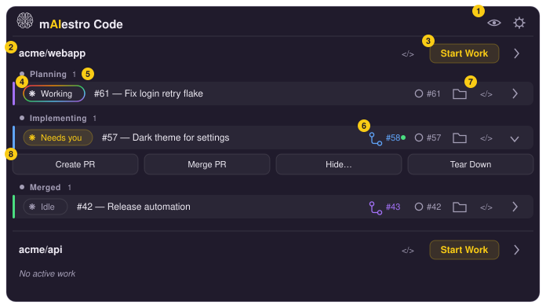

# mAIestro Code

[](https://github.com/yanokamay-org/maiestro/actions/workflows/ci.yml?query=branch%3Amain) [](https://github.com/yanokamay-org/maiestro/releases/latest) [](LICENSE)

## Why mAIestro Code

Getting real leverage out of AI coding means running **several agent sessions
in parallel**. The bottleneck stops being any single session and becomes *you*: the
constant context switching between them. That's what mAIestro Code exists to solve.
mAIestro Code colors and launches each session, and displays the session status highlighting
which sessions need attention.

mAIestro Code is deliberately **not** another place to chat with an agent. It
doesn't get in the way of your session interactions — the conversation still
happens in your editor or terminal.

## Demo Videos

- [Demo](https://www.youtube.com/watch?v=sbh8JUK22lE)
- [Walkthrough](https://www.youtube.com/watch?v=i_thfv_RaeA)

## What it is

A macOS menu-bar app that quickly shows active AI coding sessions. Features include:

- **One worktree per issue.** Spawn Work on an issue creates a branch and a
  worktree (e.g. `~/src/work-42-fix-thing/repo`), runs your setup commands, and
  opens your editor.
- **Live session status.** Each row shows what the AI engine is doing — working,
  waiting for you, idle.
- **Idea → issue.** Type a rough idea and AI drafts the GitHub issue title
  and body before anything is created.
- **PRs from the dashboard.** Create an AI-drafted pull request for a
  workspace, watch its checks, and merge it — then tear the worktree down.
- **Multiple git repo support.** Work on multiple repos at the same time.
- **Visibility and snooze controls.** Just focus on your active work. If there is a repo or work item you want to pause, just hide or snooze it for a couple of days.
- **Color coded sessions.** Each session is assigned a color and emojis for remote control sessions, so it is easy to find across multiple windows.
- **Per-identity GitHub access.** GitHub tokens are stored in the macOS
  Keychain per identity; each repo is tracked under the identity you choose.
  [Security and privacy](#security-and-privacy) covers what leaves your Mac.

## Installation

### MacOS

You need macOS, `git`, a GitHub account, and **one** agentic coding CLI —
Claude Code (the default), Codex CLI, or Antigravity CLI — installed and
logged in.

**1. Install mAIestro Code.** Download the latest `.dmg` from the
[Releases page](https://github.com/yanokamay-org/maiestro/releases) and drag
**mAIestro Code** to Applications.

**2. Install an agentic coding CLI and log in.**

<details>
<summary>Anthropic Claude Code</summary>

> Claude Code is the default. Either installer works:
>
> ```bash
> curl -fsSL https://claude.ai/install.sh | bash   # native installer
> brew install --cask claude-code                  # or via Homebrew
> ```
>
> Then check it and log in — run `claude` once and follow the browser prompt:
>
> ```bash
> claude --version   # prints e.g. 2.1.266 (Claude Code)
> claude             # log in on first run; /login inside a session re-runs it
> ```
>
> mAIestro Code stores no API key of its own —
> sessions run under your `claude` login. See the
> [Claude Code setup docs](https://code.claude.com/docs/en/setup) if the install
> misbehaves, or run `claude doctor`.

</details>

<details>
<summary>OpenAI Codex</summary>

> Install it, then log in:
>
> ```bash
> curl -fsSL https://chatgpt.com/codex/install.sh | sh
> codex --version   # 0.133.0 or newer
> codex login
> ```

</details>

<details>
<summary>Google Antigravity</summary>

> ```bash
> curl -fsSL https://antigravity.google/cli/install.sh | bash   # or: brew install --cask antigravity-cli
> agy --version   # 1.2.10 or newer
> agy             # sign in on first run
> ```

</details>

**3. Authenticate git for your sessions.**

<details>
<summary>GitHub CLI</summary>

> Spawned sessions push and fetch under your *ambient* git auth, not through
> mAIestro Code. The GitHub CLI is the easiest way to set it up, since
> `gh auth login` also sets up git's credential helper:
>
> ```bash
> brew install gh
> gh auth login      # choose HTTPS and "authenticate Git with your credentials"
> ```
</details>

**4. Recommended: a Nerd Font.**

<details>
<summary>JetBrains Mono Nerd Font</summary>

> Claude Code's terminal UI draws box-drawing and powerline glyphs that a plain
> monospace font renders as tofu (□). Install a Nerd Font with:
>
> ```bash
> brew install --cask font-jetbrains-mono-nerd-font
> ```

</details>

### Other Platforms

mAIestro Code is not yet available on other platforms, but it is designed to support multiple OS, agentic coding CLIs, etc. Please submit a github issue to request more platforms.

## Quick start

1. Click the brain icon in the menu bar and open **Settings**.
2. In **Identities**, add an identity (e.g. `default`) and save a GitHub
   personal access token for it — see [GitHub token](#github-token) below for
   the permissions it needs. The token goes into the macOS Keychain;
   `~/.maiestro/identities.json` keeps only the identity name.
3. In **Repos**, click **Add Repo**, pick the identity, and choose a repository
   from the fetched list — or type any `owner/name` you can read. Point its
   settings at your local clone if it isn't at the default `~/src/<repo-name>`.
4. Click **Check Health** at the top of the repo's settings and fix anything it
   reports — see [Check Health](#check-health) below. It catches a missing
   clone, an unresolvable `claude`, or a token without push access *before*
   they break a spawn.
5. Back in the popover, the repo lists its open issues. Hit **Spawn Work** on
   one — mAIestro Code creates the worktree, copies your env files, runs your
   post-spawn commands, and opens the editor with the agent working the issue.
   Or write your own idea and let the agent draft the issue first.
6. When the work is ready, create the PR from the workspace row (the agent drafts
   the description), merge it once checks pass, and tear the workspace down.

### GitHub token

mAIestro Code talks to the GitHub REST API directly with a token you store per
identity. A **fine-grained** personal access token
([create one](https://github.com/settings/personal-access-tokens/new)) is the
recommended kind:

- **Repository access** — *Only select repositories*, and pick every repo you
  want mAIestro Code to track (or *All repositories* if you prefer).
- **Repository permissions** — these four:

  | Permission | Access | Used for |
  | --- | --- | --- |
  | **Metadata** (required) | Read-only (no write option) | Reading the repo itself |
  | **Contents** | Read and write | How mAIestro Code derives whether the token can push |
  | **Issues** | Read and write | Listing and creating issues, assigning, commenting |
  | **Pull requests** | Read and write | Creating, reading, and merging PRs; the checks dot |

<details>
<summary>Optional permissions, classic tokens, and how the token is used</summary>

> Add **Workflows** if PRs will touch `.github/workflows/`, and **Merge
> queues** on a repo that merges through a queue — GitHub refuses those merges
> otherwise. **Actions** and **Commit statuses** are *not* needed: the PR
> pill's checks dot comes from the pull request's own `mergeable_state`, not
> the Checks or Statuses APIs, so a token without them still shows check
> state correctly.
>
> A **classic** token works too — it needs the `repo` scope (`public_repo` is
> enough for a public repo).
>
> Whichever kind you use, mAIestro Code never injects it into a spawned session;
> sessions push and fetch under your ambient git auth from `gh auth login`. The
> health check below verifies the token without ever creating a throwaway issue
> or PR to test it.

</details>

### Check Health

Each repo's settings form has a **Check Health** button that runs the
prerequisites in one pass and streams the results. Failures are
informational — they never block a spawn — and several rows come with a
copy-pasteable fix.

<details>
<summary>What it checks</summary>

> - **Cloned repo exists** — `cloned_repo_dir` is a git repo whose `origin`
>   really points at this `owner/name`.
> - **Git available** and **Session editor available** — the `git` and VS Code
>   `code` CLIs resolve (pin them under **General → Tool paths** if not).
> - **Claude logged in** (or **Codex logged in** / **Antigravity logged in**, for
>   a repo on that agentic coding CLI), with a **model available** sub-check — a
>   real probe of the repo's drafting model (for Antigravity, a check against
>   `agy models`), so a login problem and a bad model name are reported
>   separately. Only the repo's own agentic coding CLI is checked, so a machine
>   with just one agentic coding CLI installed gets a clean report.
> - **GitHub token & permissions** — the token is valid, the repo is readable,
>   and the token can push. This is derived from the scopes and permissions
>   GitHub reports; mAIestro Code never creates a throwaway issue or PR to test.
> - **Configured env files exist** and **Terminal font installed** — advisory
>   warnings, not failures.

</details>

## The main window

An annotated tour of the popover (illustrative diagram, not a screenshot):

<p align="center">
  
</p>

1. **Show-hidden toggle and Settings** — the eye reveals hidden/snoozed repos
   and workspaces; the gear opens the Settings window (identities, repos,
   appearance).
2. **Repo group** — one section per tracked repo, with a button to open its
   checkout in VS Code.
3. **Start Work** — opens the issue picker for this repo (next diagram).
4. **Agent status pill** — the Claude or OpenAI logo with the session's live state, fed by the agent's hooks:
   *Working* (rainbow ring), *Needs you* (amber — e.g. a permission prompt),
   *Ready*/*Idle* (muted). Click it to jump into the session's editor. A red
   tint means a tool call failed and Claude stopped without recovering; the
   error shows inline and can be dismissed.
5. **Lifecycle zones** — workspaces are grouped as *Planning* → *Implementing*
   (a PR exists) → *Merged*, and slide between zones as their phase changes.
6. **PR pill** — links to the workspace's pull request; the dot is the live
   checks status (green passing, spinning while running).
7. **Quick links** — open the issue on GitHub, reveal the worktree in Finder,
   or open it in VS Code.
8. **Command strip** (expand a row with its chevron) — *Create PR* (Claude
   drafts the description from the diff), *Merge PR* (creates the PR if
   needed, waits for checks, merges), *Hide…* (snooze the row), and *Tear
   Down* (remove the worktree; warns about uncommitted or unpushed work).
   While an operation runs, the row shows a busy pill — *Creating…*,
   *Creating PR…*, *Merging…*, *Tearing down…*.

Clicking **Start Work** opens the issue picker:

<p align="center">
  
</p>

1. **Idea box** — describe what you want in plain words; the agent turns it into
   a titled GitHub issue.
2. **Create Issue / Create Issue and Spawn** — file the drafted issue, or file
   it and immediately spawn a workspace for it.
3. **Open issues** — the repo's open issues, refreshable; issues that already
   have a workspace sink to the bottom with their phase.
4. **Spawn preview** — expanding an issue shows what will be created: an
   editable short session label (drafted by the agent) plus the derived
   workspace, branch, and worktree path.
5. **Spawn Work** — creates the worktree, copies env files, runs post-spawn
   commands, and opens the editor with the agent briefed on the issue.

## Configuration

Everything lives under `~/.maiestro/`, in human-editable JSON that plays well
with dotfile tooling. The Settings window is the GUI over the same files.

| Path | What it holds |
| --- | --- |
| `identities.json` | The known identity names and the optional default (the tokens themselves live in the macOS Keychain, never here) |
| `repos/<owner>-<name>.json` | Per-repo settings (see below) |
| `settings.json` | App-wide settings: theme (`light`/`dark`/`system`), CLI tool-path overrides, terminal font, launch-at-login, popover size, update-check state |
| `sessions/` / `status/` | Workspace records and live session status (managed by the app) |

Per-repo settings cover the local clone path (`cloned_repo_dir`), where
worktrees are created (`worktree_prefix`), `.env` files to copy into each new
worktree (`env_files`), shell commands to run after a worktree is created
(`post_spawn_commands`, e.g. `pnpm install`), and overrides for the prompts
mAIestro Code sends the repo's agentic coding CLI when drafting issues, labels, and PRs (`prompts`).

The format is specified by a JSON Schema at
[`backend/schemas/repo-settings.schema.json`](backend/schemas/repo-settings.schema.json)
(bundled with the app at
`/Applications/mAIestro Code.app/Contents/Resources/schemas/repo-settings.schema.json`).
Point a `$schema` key at it for autocomplete when hand-editing.

Logs are written to `~/Library/Logs/com.maiestro.app/lYYYYMM/maiestro-YYYYMMDD.log`
(UTC-dated, daily rollover) and are viewable from the app's Logs window.

## Security and privacy

### Security

**Only track repositories you trust.** Spawning a workspace runs code from
the repository and from your own settings before you see any of it, and the
agent that then works in it is steered by files the repository controls:

- **Your `post_spawn_commands` run in the new worktree** through your login
  shell (`$SHELL -lc`) with your full ambient environment, before the editor
  opens. Anything they invoke (`pnpm install`, `make setup`, …) executes
  whatever the checked-out repo provides.
- **Your `env_files` are copied from the clone into every worktree**, so any
  secrets in those `.env` files are present in each workspace you spawn.
- **VS Code opens with `--disable-workspace-trust`.** The repo's own `.vscode`
  configuration and any workspace-triggered extension behavior run without the
  "Do you trust the authors?" prompt.
- **The session is ordinary Claude Code (or Codex)**, launched interactively with
  its standard permission prompts; mAIestro Code passes no permission-bypass
  flags. The repo's committed `CLAUDE.md`, `.claude/` settings, and hooks apply
  to that session exactly as if you had run `claude` there yourself, so a
  malicious repository can influence the agent. That is Claude Code's own trust
  model, not something mAIestro Code adds or removes. The same holds for a Codex
  session and the repo's `AGENTS.md` and `.codex/` configuration, and for an
  Antigravity session and the repo's `.agents/` configuration. mAIestro Code adds
  its own status hooks to a worktree's `.agents/hooks.json`, and they never
  approve or deny a tool.
- **mAIestro Code's own drafting calls run with all tools disabled.** The
  issue, label, and PR-description drafts run `claude -p … --tools ""` (or, for
  Codex, `codex exec --sandbox read-only` with the shell and other tools
  disabled) in the repo. For Antigravity, headless `agy` runs in an empty
  mAIestro Code folder (`~/.maiestro/antigravity-draft/`) whose hook denies
  every tool. Either way, prompt injection from your idea text, an issue body, a diff, or the
  repo's `CLAUDE.md` can at worst produce a bad draft — never read files, run
  commands, or fetch URLs.

You review a drafted issue before it is created. The drafted PR is filed
directly as a GitHub draft pull request, so check its description on GitHub
before marking it ready. The agent's output is in front of you in the editor
or terminal as it works. Read it.

### Privacy

mAIestro Code runs entirely on your Mac and has no servers of its own.

**What leaves your machine, and to whom**

- **GitHub** (`api.github.com`), authenticated with the identity's token from
  the Keychain: listing repos and issues, creating and editing issues,
  assigning the issue to the token's user on spawn, posting the spawn comment,
  and creating, reading, and merging pull requests. See
  [GitHub token](#github-token).
- **GitHub** (`api.github.com`), **unauthenticated**: about every 12 hours the
  app fetches the latest release of `yanokamay-org/maiestro` to tell you when
  a newer version is out. The request carries no token, no account or machine
  identifier. Details in [`docs/update-check.md`](docs/update-check.md).
- **The spawn comment** posted on the issue names the branch, the session
  label, and your **local worktree path**, which includes your macOS
  username. The per-repo `comment_on_spawn` setting turns it off; assignment
  is not gated by it (see [`docs/settings.md`](docs/settings.md)).
- **Claude Code / Anthropic**, under your own `claude` login: the drafting
  calls send your idea text, the issue title and body, and — for PR drafts —
  the branch's commit log and its diff against the base branch (or a
  file-level summary when the diff is large), plus whatever repo context
  `claude` loads itself, such as `CLAUDE.md`. The interactive session is plain
  Claude Code, governed by Anthropic's terms for your account.
- **Remote control.** Sessions are launched with Claude Code's
  `--remote-control` flag so you can reach them from your Claude account on
  other devices. See the
  [Claude Code docs](https://code.claude.com/docs/en/remote-control) for what
  that involves.
- **Your git remotes.** Pushes and fetches inside a session use your ambient
  git auth and go wherever the repo's remotes point; mAIestro Code is not in
  that path.

**What stays local**

- Configuration under `~/.maiestro/` — identities, per-repo settings, workspace
  records, live status. See [Configuration](#configuration).
- **The GitHub token lives only in the macOS Keychain.** It is read at call
  time, sent only in the `Authorization` header to `api.github.com`, never
  injected into a spawned session, and never written to disk or to the logs.
- **Logs** at `~/Library/Logs/com.maiestro.app/` record command invocations —
  issue numbers, branch names, worktree paths, GitHub URLs — and the message
  of a failed tool call reported by a session hook. Never credentials. They
  are not pruned automatically; delete them whenever you like.
- **Generated files in each worktree**: `.claude/settings.local.json` (the
  status hooks) and `.vscode/` (theme and launch task), both excluded from
  git.

**What mAIestro Code never does**

- No telemetry, analytics, crash reporting, or usage tracking of any kind.
- No auto-update, telemetry, or phone-home beyond that version check.
  Releases are still downloaded and installed by hand from GitHub.
- No endpoints other than `api.github.com` and the local `claude` CLI.

## Development

Built with [Tauri v2](https://tauri.app): a Rust backend in `backend/` and a
React + Vite + TypeScript frontend in `frontend/`. Prerequisites, the dev
loop, tests, and the release pipeline are in
[`CONTRIBUTING.md`](CONTRIBUTING.md).

## Architecture

The recorded design decisions live in [`CLAUDE.md`](CLAUDE.md), and the
per-feature reference (settings, health check, session status, theming, tool
resolution) in [`docs/`](docs/) — those are the source of truth; the short
version:

- **mAIestro Code launches sessions, it doesn't host them.** Starting work opens a
  real VS Code window or terminal running `claude`; the app never owns the
  conversation or its stdio.
- **Session status comes from Claude Code hooks.** Spawning writes hooks into
  the worktree's `.claude/settings.local.json` that call the mAIestro Code binary,
  which writes status files the app watches.
- **GitHub via the REST API, never `gh`.** The app talks to GitHub directly
  with per-identity tokens read from the Keychain at call time.
- **Secrets in the Keychain, references in JSON.** `~/.maiestro/` holds only
  human-editable configuration; token values never touch disk.
- **Launched sessions get your ambient environment.** Launches go through
  Launch Services / your login shell, so sessions inherit your PATH, git auth,
  and `claude` login — mAIestro Code injects nothing.

## License

mAIestro Code is developed by Yanokamay LLC and released under the
[MIT License](LICENSE). It is free to use, modify, and redistribute; the
license file has the full terms.
